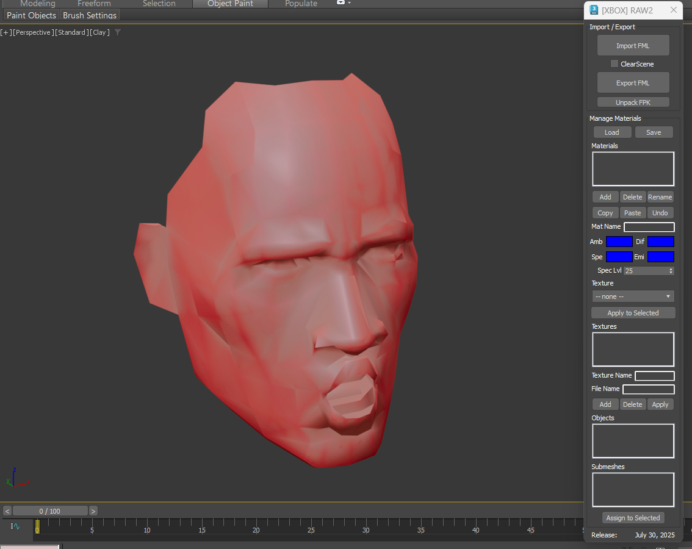

# RAW2 MaxScript Tool README

## Overview

This MaxScript tool is designed for working with assets from *WWE Raw 2* (RAW2) on the Xbox. It provides functionality to import and export 3D models in the FML (Fool Model) format, unpack FPK (Fool Package) archives, and manage materials and textures within imported models. The script is built for Autodesk 3ds Max and enables modders, researchers, or developers to extract, edit, and reinsert game assets.

The tool was originally authored by Corey Nguyen (mariokart64n) and is dated July 30, 2025. It supports little-endian data formats typical of Xbox games and handles hierarchical models with bones, weights, normals, UVs, and multi-materials.

## Features

- **Import FML Models**:
  - Load FML files into 3ds Max as editable meshes.
  - Options: Clear the scene before import, import normals (via Edit_Normals modifier), import skin weights (via Skin modifier).
  - Automatically builds hierarchy, applies materials, and fabricates bone positions if needed.
  - Supports multi-subobject materials with ambient, diffuse, specular, emissive colors, and texture mapping.

- **Export FML Models**:
  - Export selected or all scene objects back to FML format.
  - Handles vertex deduplication, normal quantization, weight normalization (up to 4 bones per vertex).
  - Preserves materials, textures, bones, and hierarchy.

- **Unpack FPK Archives**:
  - Extract files from FPK archives to a directory structure.
  - Supports recursive directories and files; saves raw data blobs (e.g., FML models, textures as DDS/TGA).

- **Material Management**:
  - Load/Save materials from/to FML.
  - Add, delete, rename, copy/paste, and undo changes.
  - Edit properties: Ambient, Diffuse, Specular (color + level), Emissive colors.
  - Assign textures from a dropdown list.
  - Apply changes to selected materials.

- **Texture Management**:
  - Add, delete, and apply texture names and file references.
  - Textures are linked to materials (e.g., diffuse map).

- **Object and Submesh Management**:
  - View objects and their submeshes.
  - Assign materials to selected submeshes.

- **Additional Capabilities**:
  - Undo stack for material/texture edits.
  - Automatic renaming to avoid duplicates.
  - Scale factor (default ~3.93701) for import/export to match game units.
  - Dialog persistence (remembers position via custom file properties).

## Installation and Usage

1. **Requirements**:
   - Autodesk 3ds Max (tested with versions supporting MaxScript; e.g., 2020+).
   - No additional plugins needed; uses built-in modifiers (Skin, Edit_Normals, Unwrap_UVW).

2. **Installation**:
   - Copy the script file (e.g., `raw2.ms`) to your 3ds Max scripts directory (e.g., `C:\Program Files\Autodesk\3ds Max 202x\scripts`).
   - Run the script via MaxScript Editor or Listener: `fileIn "path\to\raw2.ms"`.

3. **Usage**:
   - The tool opens as a rollout dialog titled "[XBOX] RAW2".
   - **Import**: Click "Import FML" and select a file. Check "ClearScene" to delete existing objects.
   - **Export**: Click "Export FML" and save to a file.
   - **Unpack**: Click "Unpack FPK" and select an archive; extracts to the same directory as the FPK.
   - **Material/Texture Editing**: Use the "Manage Materials" section to load, edit, and apply changes. Select items in listboxes and use buttons.
   - Close the dialog to save position for next use.

   Example workflow:
   - Unpack an FPK to get FML files.
   - Import an FML, edit meshes/materials in 3ds Max.
   - Export the modified FML.
   - (Packing FPK is not yet implemented; see code for `pack_fpk` stub.)

## Limitations
- No FPK packing (only unpacking; buildFromFolder exists but incomplete).
- Assumes StandardMaterial, PhysicalMaterial, or OpenPBR_Material for export.
- No direct texture loading/display in Max; references filenames (e.g., .dds).
- Bone fabrication is synthetic (averaged from weights if no explicit positions).
- Unsupported FPK versions (only v2).

## Credits
- Author: Corey Nguyen (mariokart64n)
- Email: mariokart64n@gmail.com
- Donate: [PayPal](https://www.paypal.com/cgi-bin/webscr?cmd=_donations&business=coreynguyen%40gmail%2ecom&item_name=maxscript%20work&no_shipping=0&no_note=1&tax=0&currency_code=CAD&lc=US&bn=PP%2dDonationsBF&charset=UTF%2d8)
- Based on reverse-engineering of RAW2 formats.

For more details on file formats, see the [Wiki](wiki.md). Report issues or contribute on the GitHub repo.
